# Database Design Document - ResumeFriendly AI

This document details the normalized relational database schemas, entity relationship (ER) models, field types, and optimization strategies for the ResumeFriendly AI PostgreSQL backend.

---

## 1. Entity-Relationship (ER) Diagram

```mermaid
erDiagram
    USERS {
        uuid id PK
        string email UK
        string password_hash
        string first_name
        string last_name
        string role "CANDIDATE | RECRUITER | ADMIN"
        timestamp created_at
        timestamp updated_at
    }

    RESUMES {
        uuid id PK
        uuid user_id FK "References USERS(id)"
        string file_name
        string file_path
        string raw_text
        jsonb parsed_content "JSON structured skills, experience, edu"
        timestamp uploaded_at
    }

    JOB_DESCRIPTIONS {
        uuid id PK
        uuid creator_id FK "References USERS(id)"
        string title
        string company_name
        string department
        string raw_content
        string requirements
        timestamp created_at
    }

    ATS_RESULTS {
        uuid id PK
        uuid resume_id FK "References RESUMES(id)"
        integer overall_score
        integer skills_score
        integer keywords_score
        integer experience_score
        integer formatting_score
        integer education_score
        integer contact_score
        jsonb details "Explainability, missing keywords, recommendations"
        timestamp generated_at
    }

    JD_MATCHES {
        uuid id PK
        uuid resume_id FK "References RESUMES(id)"
        uuid jd_id FK "References JOB_DESCRIPTIONS(id)"
        integer match_score
        jsonb match_details "Matched/missing skills, advice"
        timestamp matched_at
    }

    RECRUITER_UPLOADS {
        uuid id PK
        uuid recruiter_id FK "References USERS(id)"
        uuid jd_id FK "References JOB_DESCRIPTIONS(id)"
        uuid resume_id FK "References RESUMES(id)"
        timestamp uploaded_at
    }

    RESUME_VERSIONS {
        uuid id PK
        uuid resume_id FK "References RESUMES(id)"
        uuid user_id FK "References USERS(id)"
        integer version_number
        jsonb original_content
        jsonb rewritten_content
        string target_role
        string tone
        jsonb focus_areas
        timestamp created_at
    }

    INTERVIEW_SESSIONS {
        uuid id PK
        uuid user_id FK "References USERS(id)"
        uuid resume_id FK "References RESUMES(id)"
        string target_role
        string difficulty
        timestamp created_at
    }

    INTERVIEW_QUESTIONS {
        uuid id PK
        uuid session_id FK "References INTERVIEW_SESSIONS(id)"
        string question_text
        string category
        string user_answer
        jsonb ai_feedback
        integer score
        timestamp answered_at
    }

    SKILL_GAP_ANALYSES {
        uuid id PK
        uuid user_id FK "References USERS(id)"
        uuid resume_id FK "References RESUMES(id)"
        string target_role
        jsonb analysis_result
        timestamp created_at
    }

    CAREER_ROADMAPS {
        uuid id PK
        uuid user_id FK "References USERS(id)"
        uuid resume_id FK "References RESUMES(id)"
        string current_role
        string target_role
        integer timeline_months
        jsonb roadmap_data
        timestamp created_at
    }

    JOB_APPLICATIONS {
        uuid id PK
        uuid user_id FK "References USERS(id)"
        string company_name
        string job_title
        string job_url
        string status
        date applied_date
        string salary_range
        string notes
        date next_followup
        timestamp created_at
        timestamp updated_at
    }

    COACH_CONVERSATIONS {
        uuid id PK
        uuid user_id FK "References USERS(id)"
        uuid resume_id FK "References RESUMES(id)"
        string title
        timestamp created_at
        timestamp updated_at
    }

    COACH_MESSAGES {
        uuid id PK
        uuid conversation_id FK "References COACH_CONVERSATIONS(id)"
        string role
        string content
        timestamp created_at
    }

    JOBS {
        uuid id PK
        uuid recruiter_id FK "References USERS(id)"
        string title
        string department
        string employment_type
        string experience_required
        string location
        string salary_range
        text description
        string status
        timestamp created_at
        timestamp updated_at
    }

    JOB_SKILLS {
        uuid id PK
        uuid job_id FK "References JOBS(id)"
        string skill_name
        boolean is_required
    }

    TEAM_MEMBERS {
        uuid id PK
        uuid job_id FK "References JOBS(id)"
        uuid user_id FK "References USERS(id)"
        string role
        timestamp added_at
    }

    CANDIDATE_PIPELINE {
        uuid id PK
        uuid job_id FK "References JOBS(id)"
        uuid resume_id FK "References RESUMES(id)"
        string stage
        integer ats_score
        integer jd_match_score
        timestamp created_at
        timestamp updated_at
    }

    CANDIDATE_STAGE_HISTORY {
        uuid id PK
        uuid pipeline_id FK "References CANDIDATE_PIPELINE(id)"
        string from_stage
        string to_stage
        uuid moved_by FK "References USERS(id)"
        timestamp moved_at
        text notes
    }

    CANDIDATE_NOTES {
        uuid id PK
        uuid pipeline_id FK "References CANDIDATE_PIPELINE(id)"
        uuid recruiter_id FK "References USERS(id)"
        text content
        timestamp created_at
    }

    CANDIDATE_FEEDBACK {
        uuid id PK
        uuid pipeline_id FK "References CANDIDATE_PIPELINE(id)"
        uuid interviewer_id FK "References USERS(id)"
        integer score
        text feedback_text
        timestamp created_at
    }

    CANDIDATE_COMPARISONS {
        uuid id PK
        uuid job_id FK "References JOBS(id)"
        jsonb candidate_ids
        text ai_summary
        text best_candidate_recommendation
        timestamp created_at
    }

    INTERVIEW_KITS {
        uuid id PK
        uuid job_id FK "References JOBS(id)"
        uuid resume_id FK "References RESUMES(id)"
        jsonb technical_questions
        jsonb behavioral_questions
        jsonb scenario_questions
        jsonb role_specific_questions
        text evaluation_rubric
        text scoring_template
        text interviewer_notes
        timestamp created_at
    }

    RECRUITER_ANALYTICS {
        uuid id PK
        uuid recruiter_id FK "References USERS(id)"
        string metric_name
        float metric_value
        timestamp recorded_at
    }

    ACTIVITY_LOGS {
        uuid id PK
        uuid user_id FK "References USERS(id)"
        string action_type
        text details
        timestamp created_at
    }

    USERS ||--o{ RESUMES : "uploads"
    USERS ||--o{ JOB_DESCRIPTIONS : "creates"
    USERS ||--o{ RECRUITER_UPLOADS : "batch_uploads"
    RESUMES ||--o| ATS_RESULTS : "analyzed_into"
    RESUMES ||--o{ JD_MATCHES : "scored_against"
    JOB_DESCRIPTIONS ||--o{ JD_MATCHES : "scores"
    JOB_DESCRIPTIONS ||--o{ RECRUITER_UPLOADS : "contains"
    RESUMES ||--o{ RECRUITER_UPLOADS : "uploaded_as"
    RESUMES ||--o{ RESUME_VERSIONS : "versions"
    USERS ||--o{ INTERVIEW_SESSIONS : "conducts"
    INTERVIEW_SESSIONS ||--o{ INTERVIEW_QUESTIONS : "contains"
    USERS ||--o{ SKILL_GAP_ANALYSES : "triggers"
    USERS ||--o{ CAREER_ROADMAPS : "generates"
    USERS ||--o{ JOB_APPLICATIONS : "tracks"
    USERS ||--o{ COACH_CONVERSATIONS : "starts"
    COACH_CONVERSATIONS ||--o{ COACH_MESSAGES : "sends"
    USERS ||--o{ JOBS : "manages"
    JOBS ||--o{ JOB_SKILLS : "specifies"
    JOBS ||--o{ TEAM_MEMBERS : "shares_with"
    USERS ||--o{ TEAM_MEMBERS : "collaborates_on"
    JOBS ||--o{ CANDIDATE_PIPELINE : "screens_for"
    RESUMES ||--o{ CANDIDATE_PIPELINE : "placed_in"
    CANDIDATE_PIPELINE ||--o{ CANDIDATE_STAGE_HISTORY : "tracks_history"
    CANDIDATE_PIPELINE ||--o{ CANDIDATE_NOTES : "gathers_notes"
    CANDIDATE_PIPELINE ||--o{ CANDIDATE_FEEDBACK : "gathers_feedback"
    JOBS ||--o{ CANDIDATE_COMPARISONS : "compares_candidates"
    JOBS ||--o{ INTERVIEW_KITS : "requires_kits"
    RESUMES ||--o{ INTERVIEW_KITS : "evaluated_by_kits"
    USERS ||--o{ RECRUITER_ANALYTICS : "measures_performance"
    USERS ||--o{ ACTIVITY_LOGS : "logs_activities"
```

---

## 2. Table Specifications

### 2.1 USERS
Stores accounts, hashed credentials, and platform roles.
- `id`: `UUID` (Primary Key, default: `gen_random_uuid()`)
- `email`: `VARCHAR(255)` (Unique, Not Null, Indexed)
- `password_hash`: `VARCHAR(255)` (Not Null)
- `first_name`: `VARCHAR(100)`
- `last_name`: `VARCHAR(100)`
- `role`: `VARCHAR(50)` (Not Null, default: `'CANDIDATE'`)
- `created_at`: `TIMESTAMP WITH TIME ZONE` (default: `NOW()`)
- `updated_at`: `TIMESTAMP WITH TIME ZONE` (default: `NOW()`)

### 2.2 RESUMES
Metadata and structured representation of candidate resumes.
- `id`: `UUID` (Primary Key)
- `user_id`: `UUID` (Foreign Key -> `USERS(id)`, Nullable for quick/anonymous recruiter uploads)
- `file_name`: `VARCHAR(255)` (Not Null)
- `file_path`: `VARCHAR(512)` (Not Null)
- `raw_text`: `TEXT` (Not Null)
- `parsed_content`: `JSONB` (Not Null - structured data: skills list, experience objects, education details, projects)
- `uploaded_at`: `TIMESTAMP WITH TIME ZONE` (default: `NOW()`)

### 2.3 JOB_DESCRIPTIONS
Job profiles defined by recruiters.
- `id`: `UUID` (Primary Key)
- `creator_id`: `UUID` (Foreign Key -> `USERS(id)`, Not Null)
- `title`: `VARCHAR(255)` (Not Null)
- `company_name`: `VARCHAR(255)` (Not Null)
- `department`: `VARCHAR(255)` (Nullable)
- `raw_content`: `TEXT` (Not Null)
- `requirements`: `TEXT` (Nullable)
- `created_at`: `TIMESTAMP WITH TIME ZONE` (default: `NOW()`)

### 2.4 ATS_RESULTS
ATS score analysis breakdown and optimization alerts.
- `id`: `UUID` (Primary Key)
- `resume_id`: `UUID` (Foreign Key -> `RESUMES(id)`, Cascade Delete, Unique)
- `overall_score`: `INTEGER` (Not Null)
- `skills_score`: `INTEGER` (Not Null)
- `keywords_score`: `INTEGER` (Not Null)
- `experience_score`: `INTEGER` (Not Null)
- `formatting_score`: `INTEGER` (Not Null)
- `education_score`: `INTEGER` (Not Null)
- `contact_score`: `INTEGER` (Not Null)
- `details`: `JSONB` (Not Null - contains lists of: missing keywords, missing sections, formatting issues, content recommendations)
- `generated_at`: `TIMESTAMP WITH TIME ZONE` (default: `NOW()`)

### 2.5 JD_MATCHES
Scores and gaps identified between a candidate's resume and a specific JD.
- `id`: `UUID` (Primary Key)
- `resume_id`: `UUID` (Foreign Key -> `RESUMES(id)`, Cascade Delete)
- `jd_id`: `UUID` (Foreign Key -> `JOB_DESCRIPTIONS(id)`, Cascade Delete)
- `match_score`: `INTEGER` (Not Null)
- `match_details`: `JSONB` (Not Null - matched skills, missing skills, customized optimization feedback)
- `matched_at`: `TIMESTAMP WITH TIME ZONE` (default: `NOW()`)

### 2.6 RECRUITER_UPLOADS
Map of resumes uploaded by recruiters to screen against job specifications.
- `id`: `UUID` (Primary Key)
- `recruiter_id`: `UUID` (Foreign Key -> `USERS(id)`)
- `jd_id`: `UUID` (Foreign Key -> `JOB_DESCRIPTIONS(id)`)
- `resume_id`: `UUID` (Foreign Key -> `RESUMES(id)`)
- `uploaded_at`: `TIMESTAMP WITH TIME ZONE` (default: `NOW()`)

### 2.7 RESUME_VERSIONS
Tracks rewrites, original vs rewritten segments, tone and focus selections.
- `id`: `UUID` (Primary Key)
- `resume_id`: `UUID` (Foreign Key -> `RESUMES(id)`, Cascade Delete)
- `user_id`: `UUID` (Foreign Key -> `USERS(id)`, Cascade Delete)
- `version_number`: `INTEGER` (Not Null)
- `original_content`: `JSONB` (Not Null)
- `rewritten_content`: `JSONB` (Not Null)
- `target_role`: `VARCHAR(255)` (Not Null)
- `tone`: `VARCHAR(50)` (Not Null)
- `focus_areas`: `JSONB` (Not Null)
- `created_at`: `TIMESTAMP WITH TIME ZONE` (default: `NOW()`)

### 2.8 INTERVIEW_SESSIONS
Mock interview session parameters and metadata.
- `id`: `UUID` (Primary Key)
- `user_id`: `UUID` (Foreign Key -> `USERS(id)`, Cascade Delete)
- `resume_id`: `UUID` (Foreign Key -> `RESUMES(id)`, Cascade Delete)
- `target_role`: `VARCHAR(255)` (Not Null)
- `difficulty`: `VARCHAR(50)` (Not Null)
- `created_at`: `TIMESTAMP WITH TIME ZONE` (default: `NOW()`)

### 2.9 INTERVIEW_QUESTIONS
Mock Q&A items, typed categories, answer submissions, and feedback ratings.
- `id`: `UUID` (Primary Key)
- `session_id`: `UUID` (Foreign Key -> `INTERVIEW_SESSIONS(id)`, Cascade Delete)
- `question_text`: `TEXT` (Not Null)
- `category`: `VARCHAR(100)` (Not Null)
- `user_answer`: `TEXT` (Nullable)
- `ai_feedback`: `JSONB` (Nullable - contains strengths, improvements, model STAR structure analysis)
- `score`: `INTEGER` (Nullable)
- `answered_at`: `TIMESTAMP WITH TIME ZONE` (Nullable)

### 2.10 SKILL_GAP_ANALYSES
Historic gap reports and suggested learning details.
- `id`: `UUID` (Primary Key)
- `user_id`: `UUID` (Foreign Key -> `USERS(id)`, Cascade Delete)
- `resume_id`: `UUID` (Foreign Key -> `RESUMES(id)`, Cascade Delete)
- `target_role`: `VARCHAR(255)` (Not Null)
- `analysis_result`: `JSONB` (Not Null - missing skills list, proficiency ratings, course links)
- `created_at`: `TIMESTAMP WITH TIME ZONE` (default: `NOW()`)

### 2.11 CAREER_ROADMAPS
Milestone paths, timeline progression schedules, and certification plans.
- `id`: `UUID` (Primary Key)
- `user_id`: `UUID` (Foreign Key -> `USERS(id)`, Cascade Delete)
- `resume_id`: `UUID` (Foreign Key -> `RESUMES(id)`, Cascade Delete)
- `current_role`: `VARCHAR(255)` (Not Null)
- `target_role`: `VARCHAR(255)` (Not Null)
- `timeline_months`: `INTEGER` (Not Null)
- `roadmap_data`: `JSONB` (Not Null - milestone definitions, task items, timelines)
- `created_at`: `TIMESTAMP WITH TIME ZONE` (default: `NOW()`)

### 2.12 JOB_APPLICATIONS
Standard job application tracking information.
- `id`: `UUID` (Primary Key)
- `user_id`: `UUID` (Foreign Key -> `USERS(id)`, Cascade Delete)
- `company_name`: `VARCHAR(255)` (Not Null)
- `job_title`: `VARCHAR(255)` (Not Null)
- `job_url`: `VARCHAR(512)` (Nullable)
- `status`: `VARCHAR(50)` (Not Null - applied, screening, interviewing, offer, rejected, accepted)
- `applied_date`: `DATE` (Not Null)
- `salary_range`: `VARCHAR(100)` (Nullable)
- `notes`: `TEXT` (Nullable)
- `next_followup`: `DATE` (Nullable)
- `created_at`: `TIMESTAMP WITH TIME ZONE` (default: `NOW()`)
- `updated_at`: `TIMESTAMP WITH TIME ZONE` (default: `NOW()`)

### 2.13 COACH_CONVERSATIONS
Discussion channels and session groups.
- `id`: `UUID` (Primary Key)
- `user_id`: `UUID` (Foreign Key -> `USERS(id)`, Cascade Delete)
- `resume_id`: `UUID` (Foreign Key -> `RESUMES(id)`, Cascade Delete)
- `title`: `VARCHAR(255)` (Not Null)
- `created_at`: `TIMESTAMP WITH TIME ZONE` (default: `NOW()`)
- `updated_at`: `TIMESTAMP WITH TIME ZONE` (default: `NOW()`)

### 2.14 COACH_MESSAGES
Detailed chat thread transcripts.
- `id`: `UUID` (Primary Key)
- `conversation_id`: `UUID` (Foreign Key -> `COACH_CONVERSATIONS(id)`, Cascade Delete)
- `role`: `VARCHAR(50)` (Not Null - user, assistant)
- `content`: `TEXT` (Not Null)
- `created_at`: `TIMESTAMP WITH TIME ZONE` (default: `NOW()`)

### 2.15 JOBS
Stores comprehensive job opening configurations.
- `id`: `UUID` (Primary Key, default: `gen_random_uuid()`)
- `recruiter_id`: `UUID` (Foreign Key -> `USERS(id)`, Cascade Delete, Not Null)
- `title`: `VARCHAR(255)` (Not Null)
- `department`: `VARCHAR(255)` (Nullable)
- `employment_type`: `VARCHAR(100)` (Nullable, e.g., 'Full-time', 'Part-time')
- `experience_required`: `VARCHAR(100)` (Nullable)
- `location`: `VARCHAR(255)` (Nullable)
- `salary_range`: `VARCHAR(100)` (Nullable)
- `description`: `TEXT` (Nullable)
- `status`: `VARCHAR(50)` (Not Null, default: `'Active'`)
- `created_at`: `TIMESTAMP WITH TIME ZONE` (default: `NOW()`)
- `updated_at`: `TIMESTAMP WITH TIME ZONE` (default: `NOW()`)

### 2.16 JOB_SKILLS
Skills requested by a specific job profile.
- `id`: `UUID` (Primary Key, default: `gen_random_uuid()`)
- `job_id`: `UUID` (Foreign Key -> `JOBS(id)`, Cascade Delete, Not Null)
- `skill_name`: `VARCHAR(100)` (Not Null)
- `is_required`: `BOOLEAN` (Not Null, default: `True`)

### 2.17 TEAM_MEMBERS
Recruiter collaboration sharing map.
- `id`: `UUID` (Primary Key, default: `gen_random_uuid()`)
- `job_id`: `UUID` (Foreign Key -> `JOBS(id)`, Cascade Delete, Not Null)
- `user_id`: `UUID` (Foreign Key -> `USERS(id)`, Cascade Delete, Not Null)
- `role`: `VARCHAR(100)` (Not Null)
- `added_at`: `TIMESTAMP WITH TIME ZONE` (default: `NOW()`)

### 2.18 CANDIDATE_PIPELINE
Tracks candidates mapped to jobs along with hiring pipeline stages.
- `id`: `UUID` (Primary Key, default: `gen_random_uuid()`)
- `job_id`: `UUID` (Foreign Key -> `JOBS(id)`, Cascade Delete, Not Null)
- `resume_id`: `UUID` (Foreign Key -> `RESUMES(id)`, Cascade Delete, Not Null)
- `stage`: `VARCHAR(100)` (Not Null, default: `'Applied'`)
- `ats_score`: `INTEGER` (Nullable)
- `jd_match_score`: `INTEGER` (Nullable)
- `created_at`: `TIMESTAMP WITH TIME ZONE` (default: `NOW()`)
- `updated_at`: `TIMESTAMP WITH TIME ZONE` (default: `NOW()`)

### 2.19 CANDIDATE_STAGE_HISTORY
Chronological logging of candidate movements across pipeline stages.
- `id`: `UUID` (Primary Key, default: `gen_random_uuid()`)
- `pipeline_id`: `UUID` (Foreign Key -> `CANDIDATE_PIPELINE(id)`, Cascade Delete, Not Null)
- `from_stage`: `VARCHAR(100)` (Not Null)
- `to_stage`: `VARCHAR(100)` (Not Null)
- `moved_by`: `UUID` (Foreign Key -> `USERS(id)`, Set Null, Nullable)
- `moved_at`: `TIMESTAMP WITH TIME ZONE` (default: `NOW()`)
- `notes`: `TEXT` (Nullable)

### 2.20 CANDIDATE_NOTES
Internal collaboration comments on candidates.
- `id`: `UUID` (Primary Key, default: `gen_random_uuid()`)
- `pipeline_id`: `UUID` (Foreign Key -> `CANDIDATE_PIPELINE(id)`, Cascade Delete, Not Null)
- `recruiter_id`: `UUID` (Foreign Key -> `USERS(id)`, Cascade Delete, Not Null)
- `content`: `TEXT` (Not Null)
- `created_at`: `TIMESTAMP WITH TIME ZONE` (default: `NOW()`)

### 2.21 CANDIDATE_FEEDBACK
Evaluation and ratings logged by interviewers.
- `id`: `UUID` (Primary Key, default: `gen_random_uuid()`)
- `pipeline_id`: `UUID` (Foreign Key -> `CANDIDATE_PIPELINE(id)`, Cascade Delete, Not Null)
- `interviewer_id`: `UUID` (Foreign Key -> `USERS(id)`, Cascade Delete, Not Null)
- `score`: `INTEGER` (Not Null - rating 1-5)
- `feedback_text`: `TEXT` (Nullable)
- `created_at`: `TIMESTAMP WITH TIME ZONE` (default: `NOW()`)

### 2.22 CANDIDATE_COMPARISONS
Persisted side-by-side AI evaluation sessions.
- `id`: `UUID` (Primary Key, default: `gen_random_uuid()`)
- `job_id`: `UUID` (Foreign Key -> `JOBS(id)`, Cascade Delete, Not Null)
- `candidate_ids`: `JSONB` (Not Null - list of candidate UUIDs)
- `ai_summary`: `TEXT` (Nullable)
- `best_candidate_recommendation`: `TEXT` (Nullable)
- `created_at`: `TIMESTAMP WITH TIME ZONE` (default: `NOW()`)

### 2.23 INTERVIEW_KITS
Structured candidate/job evaluation kits with questions.
- `id`: `UUID` (Primary Key, default: `gen_random_uuid()`)
- `job_id`: `UUID` (Foreign Key -> `JOBS(id)`, Cascade Delete, Not Null)
- `resume_id`: `UUID` (Foreign Key -> `RESUMES(id)`, Cascade Delete, Not Null)
- `technical_questions`: `JSONB` (Nullable)
- `behavioral_questions`: `JSONB` (Nullable)
- `scenario_questions`: `JSONB` (Nullable)
- `role_specific_questions`: `JSONB` (Nullable)
- `evaluation_rubric`: `TEXT` (Nullable)
- `scoring_template`: `TEXT` (Nullable)
- `interviewer_notes`: `TEXT` (Nullable)
- `created_at`: `TIMESTAMP WITH TIME ZONE` (default: `NOW()`)

### 2.24 RECRUITER_ANALYTICS
Hiring metrics logs for analytics computations.
- `id`: `UUID` (Primary Key, default: `gen_random_uuid()`)
- `recruiter_id`: `UUID` (Foreign Key -> `USERS(id)`, Cascade Delete, Not Null)
- `metric_name`: `VARCHAR(100)` (Not Null)
- `metric_value`: `DOUBLE PRECISION` (Not Null)
- `recorded_at`: `TIMESTAMP WITH TIME ZONE` (default: `NOW()`)

### 2.25 ACTIVITY_LOGS
Auditing logs of operations executed by recruiters and administrators.
- `id`: `UUID` (Primary Key, default: `gen_random_uuid()`)
- `user_id`: `UUID` (Foreign Key -> `USERS(id)`, Cascade Delete, Not Null)
- `action_type`: `VARCHAR(100)` (Not Null)
- `details`: `TEXT` (Nullable)
- `created_at`: `TIMESTAMP WITH TIME ZONE` (default: `NOW()`)

---

## 3. Indexing & Optimization Strategy

To maintain sub-second queries for active dashboards as files and users scale, we define target indexes:

1. **B-Tree Indexes**:
   - `idx_users_email` ON `users(email)`: For fast user lookup at login.
   - `idx_resumes_user_id` ON `resumes(user_id)`: Speeds up fetching history on candidate profiles.
   - `idx_jds_creator_id` ON `job_descriptions(creator_id)`: Speeds up dashboard listings for active recruiters.
   - `idx_jd_matches_lookup` ON `jd_matches(resume_id, jd_id)`: Quick evaluation of historic evaluations.
   - `idx_rec_upload_lookup` ON `recruiter_uploads(recruiter_id, jd_id)`: Quickly lists resumes queued for a job description.
   - `idx_resume_versions_lookup` ON `resume_versions(resume_id, version_number)`: Instant lookup for rewriter histories.
   - `idx_interview_questions_session` ON `interview_questions(session_id)`: Quick retrieval of chat/interview Q&As.
   - `idx_job_applications_user` ON `job_applications(user_id, status)`: Optimization for candidate Kanban tracker pipelines.
   - `idx_coach_messages_convo` ON `coach_messages(conversation_id, created_at)`: Speed up active chat scroll loading.
   - `idx_jobs_recruiter_id` ON `jobs(recruiter_id)`: Optimized listing of recruiter jobs.
   - `idx_job_skills_job_id` ON `job_skills(job_id)`: Fast skills lookup for a specific job opening.
   - `idx_candidate_pipeline_job_id` ON `candidate_pipeline(job_id)`: Speeds up rendering Kanban stage pipelines.
   - `idx_candidate_pipeline_resume_id` ON `candidate_pipeline(resume_id)`: Speeds up fetching pipeline records for a single candidate.
   - `idx_candidate_stage_history_pipeline` ON `candidate_stage_history(pipeline_id)`: Quick timeline audit load times.
   - `idx_candidate_notes_pipeline` ON `candidate_notes(pipeline_id)`: Fast loading of collaborator comments.
   - `idx_candidate_feedback_pipeline` ON `candidate_feedback(pipeline_id)`: Speeds up fetching ratings.
   - `idx_recruiter_analytics_recruiter` ON `recruiter_analytics(recruiter_id, metric_name)`: Quick extraction of recorded stats.
   - `idx_activity_logs_user` ON `activity_logs(user_id)`: Audit trail dashboard retrieval speedups.

2. **JSONB Indexing**:
   - `idx_resumes_skills` ON `resumes USING gin ((parsed_content -> 'skills'))`: Speeds up custom recruiter searches filtering resumes by exact skill tags.
   - `idx_candidate_comparisons_ids` ON `candidate_comparisons USING gin (candidate_ids)`: Speed up active candidate comparison loads.
   - `idx_interview_kits_job_resume` ON `interview_kits(job_id, resume_id)`: Fast loading of generated guides.

