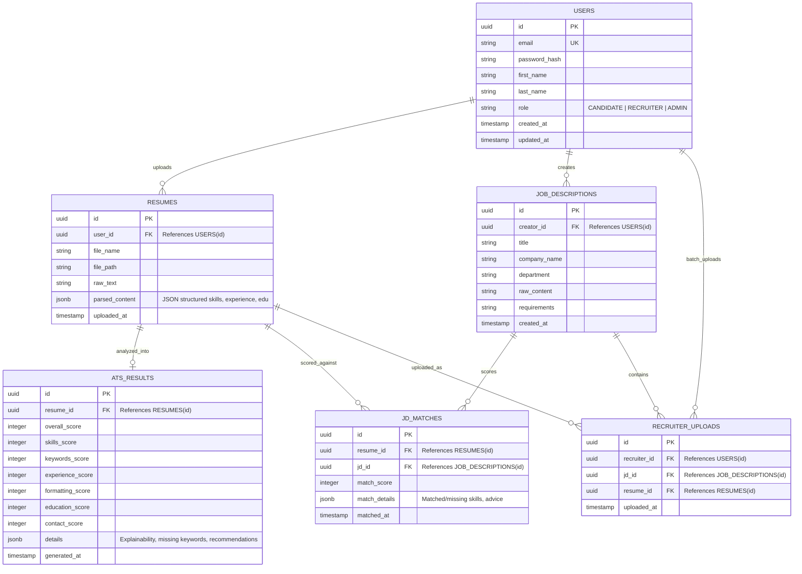

# Database Design Document - ResumeFriendly AI

This document details the normalized relational database schemas, entity relationship (ER) models, field types, and optimization strategies for the ResumeFriendly AI PostgreSQL backend.

---

## 1. Entity-Relationship (ER) Diagram

---

## 2. Table Specifications

### 2.1 USERS
Stores accounts, hashed credentials, and platform roles.
- `id`: `UUID` (Primary Key, default: `gen_random_uuid()`)
- `email`: `VARCHAR(255)` (Unique, Not Null, Indexed)
- `password_hash`: `VARCHAR(255)` (Not Null)
- `first_name`: `VARCHAR(100)`
- `last_name`: `VARCHAR(100)`
- `role`: `VARCHAR(50)` (Not Null, default: `'CANDIDATE'`)
- `created_at`: `TIMESTAMP WITH TIME ZONE` (default: `NOW()`)
- `updated_at`: `TIMESTAMP WITH TIME ZONE` (default: `NOW()`)

### 2.2 RESUMES
Metadata and structured representation of candidate resumes.
- `id`: `UUID` (Primary Key)
- `user_id`: `UUID` (Foreign Key -> `USERS(id)`, Nullable for quick/anonymous recruiter uploads)
- `file_name`: `VARCHAR(255)` (Not Null)
- `file_path`: `VARCHAR(512)` (Not Null)
- `raw_text`: `TEXT` (Not Null)
- `parsed_content`: `JSONB` (Not Null - structured data: skills list, experience objects, education details, projects)
- `uploaded_at`: `TIMESTAMP WITH TIME ZONE` (default: `NOW()`)

### 2.3 JOB_DESCRIPTIONS
Job profiles defined by recruiters.
- `id`: `UUID` (Primary Key)
- `creator_id`: `UUID` (Foreign Key -> `USERS(id)`, Not Null)
- `title`: `VARCHAR(255)` (Not Null)
- `company_name`: `VARCHAR(255)` (Not Null)
- `department`: `VARCHAR(255)` (Nullable)
- `raw_content`: `TEXT` (Not Null)
- `requirements`: `TEXT` (Nullable)
- `created_at`: `TIMESTAMP WITH TIME ZONE` (default: `NOW()`)

### 2.4 ATS_RESULTS
ATS score analysis breakdown and optimization alerts.
- `id`: `UUID` (Primary Key)
- `resume_id`: `UUID` (Foreign Key -> `RESUMES(id)`, Cascade Delete, Unique)
- `overall_score`: `INTEGER` (Not Null)
- `skills_score`: `INTEGER` (Not Null)
- `keywords_score`: `INTEGER` (Not Null)
- `experience_score`: `INTEGER` (Not Null)
- `formatting_score`: `INTEGER` (Not Null)
- `education_score`: `INTEGER` (Not Null)
- `contact_score`: `INTEGER` (Not Null)
- `details`: `JSONB` (Not Null - contains lists of: missing keywords, missing sections, formatting issues, content recommendations)
- `generated_at`: `TIMESTAMP WITH TIME ZONE` (default: `NOW()`)

### 2.5 JD_MATCHES
Scores and gaps identified between a candidate's resume and a specific JD.
- `id`: `UUID` (Primary Key)
- `resume_id`: `UUID` (Foreign Key -> `RESUMES(id)`, Cascade Delete)
- `jd_id`: `UUID` (Foreign Key -> `JOB_DESCRIPTIONS(id)`, Cascade Delete)
- `match_score`: `INTEGER` (Not Null)
- `match_details`: `JSONB` (Not Null - matched skills, missing skills, customized optimization feedback)
- `matched_at`: `TIMESTAMP WITH TIME ZONE` (default: `NOW()`)

### 2.6 RECRUITER_UPLOADS
Map of resumes uploaded by recruiters to screen against job specifications.
- `id`: `UUID` (Primary Key)
- `recruiter_id`: `UUID` (Foreign Key -> `USERS(id)`)
- `jd_id`: `UUID` (Foreign Key -> `JOB_DESCRIPTIONS(id)`)
- `resume_id`: `UUID` (Foreign Key -> `RESUMES(id)`)
- `uploaded_at`: `TIMESTAMP WITH TIME ZONE` (default: `NOW()`)

---

## 3. Indexing & Optimization Strategy

To maintain sub-second queries for active dashboards as files and users scale, we define target indexes:

1. **B-Tree Indexes**:
   - `idx_users_email` ON `users(email)`: For fast user lookup at login.
   - `idx_resumes_user_id` ON `resumes(user_id)`: Speeds up fetching history on candidate profiles.
   - `idx_jds_creator_id` ON `job_descriptions(creator_id)`: Speeds up dashboard listings for active recruiters.
   - `idx_jd_matches_lookup` ON `jd_matches(resume_id, jd_id)`: Quick evaluation of historic evaluations.
   - `idx_rec_upload_lookup` ON `recruiter_uploads(recruiter_id, jd_id)`: Quickly lists resumes queued for a job description.

2. **JSONB Indexing**:
   - `idx_resumes_skills` ON `resumes USING gin ((parsed_content -> 'skills'))`: Speeds up custom recruiter searches filtering resumes by exact skill tags.
