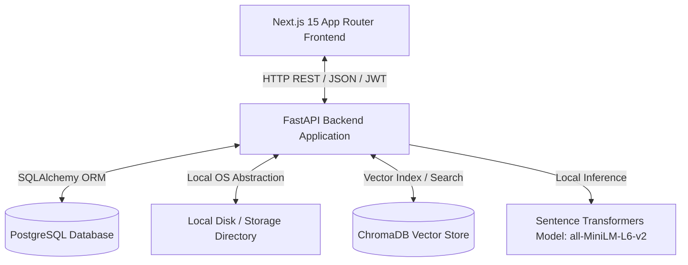
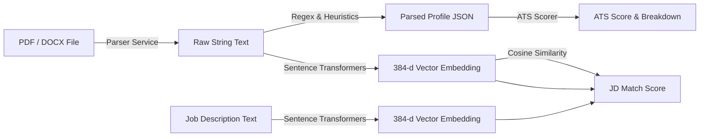
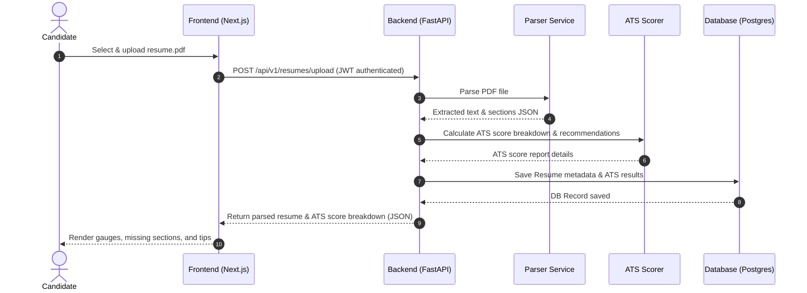
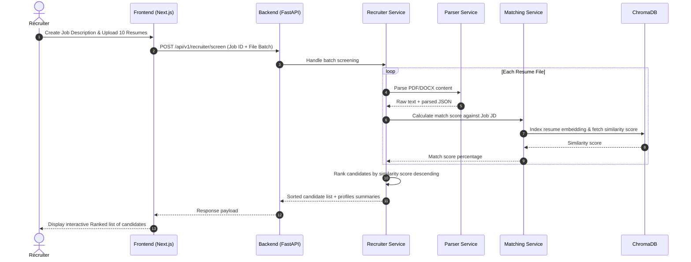
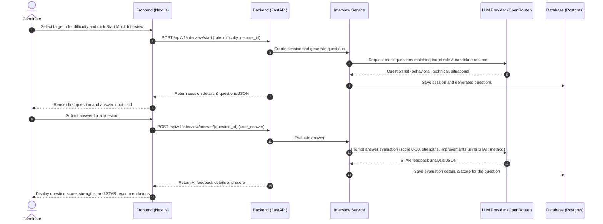

# System Design Document - ResumeFriendly AI

This document provides a detailed overview of the system architecture, component structures, data flow, and processing sequences for the ResumeFriendly AI platform.

---

## 1. High-Level Architecture

ResumeFriendly AI is designed around a decoupled client-server architecture. The frontend application coordinates user interactions, state management, and visual reports, while the backend API processes heavy text parsing, calculations, and vector embedding matching.



### Key Components:
1. **Next.js Web Client**: A client-side optimized interface styled with Tailwind CSS, utilizing Framer Motion for animations and Shadcn UI components.
2. **FastAPI Application**: High-performance asynchronous Python API which exposes JWT authentication, file uploads, parses content, and handles similarity match requests.
3. **PostgreSQL**: Serves as the relational storage engine for structured user profiles, logs, ATS score reports, JDs, and candidate histories.
4. **Sentence Transformers**: Runs standard local embeddings modeling for resumes and JDs without requiring cloud API calls.
5. **ChromaDB**: Simple embedded vector database storing semantic document embeddings for real-time ranking and semantic search queries.
6. **Storage Layer**: Local filesystem directory for saving resumes and documents, hidden behind a file abstraction interface for easy migration to AWS S3.

---

## 2. Component Diagram

The backend system is structured following Clean Architecture principles, enhanced with the pluggable AI Career Services layer:

```mermaid
graph TB
    subgraph API Controller Layer
        A1[Auth Router]
        A2[Resume Router]
        A3[ATS Router]
        A4[JD Router]
        A5[Recruiter Router]
        A6[Rewriter Router]
        A7[Interview Router]
        A8[Skills Router]
        A9[Roadmap Router]
        A10[Tracker Router]
        A11[Job Match Router]
        A12[Coach Router]
    end

    subgraph Service Layer (Business Logic)
        S1[Auth Service]
        S2[Parser Service]
        S3[ATS Scorer]
        S4[Matching Service]
        S5[Recruiter Service]
        S6[Rewriter Service]
        S7[Interview Service]
        S8[Skill Gap Service]
        S9[Roadmap Service]
        S10[Tracker Service]
        S11[Job Match Service]
        S12[Coach Service]
        LLM[LLM Provider Factory]
    end

    subgraph Repository & ORM Layer
        R1[User Repository]
        R2[Resume Repository]
        R3[JD Repository]
        R4[ATS Result Repository]
        R5[JD Match Repository]
        R6[Resume Version Repository]
        R7[Interview Session Repository]
        R8[Skill Gap Repository]
        R9[Roadmap Repository]
        R10[Application Repository]
        R11[Coach Conversation Repository]
    end

    subgraph Data & Storage Layer
        D1[(PostgreSQL)]
        D2[(ChromaDB)]
        D3[Local Files]
        D4[OpenRouter API]
    end

    A1 --> S1
    A2 --> S2
    A3 --> S3
    A4 --> S4
    A5 --> S5
    A6 --> S6
    A7 --> S7
    A8 --> S8
    A9 --> S9
    A10 --> S10
    A11 --> S11
    A12 --> S12

    S1 --> R1
    S2 --> R2
    S3 --> R4
    S4 --> R3
    S4 --> R5
    S5 --> R3
    S5 --> R2
    S6 & S7 & S8 & S9 & S12 --> LLM
    S6 --> R6
    S7 --> R7
    S8 --> R8
    S9 --> R9
    S10 --> R10
    S11 --> S4
    S12 --> R11

    R1 & R2 & R3 & R4 & R5 & R6 & R7 & R8 & R9 & R10 & R11 --> D1
    S4 & S5 --> D2
    S2 --> D3
    LLM --> D4
```


---

## 3. Data Flow Diagram (Resume Parsing & Matching)

This diagram shows how a Candidate's Resume is parsed, score-broken-down, and matched against a job description.



---

## 4. Sequence Diagrams

### 4.1 Candidate Resume Upload & ATS Score Generation



### 4.2 Recruiter Multi-Candidate Screening & Ranking



### 4.3 Candidate Mock Interview & AI Answer Evaluation



