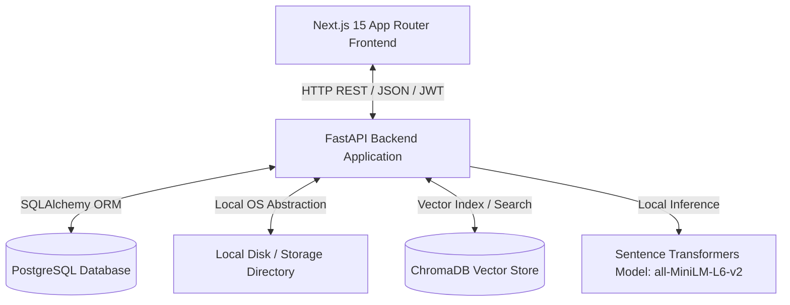
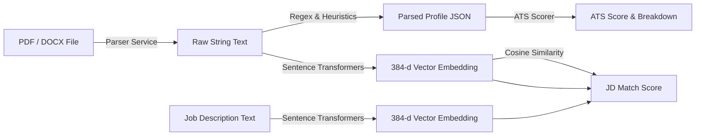
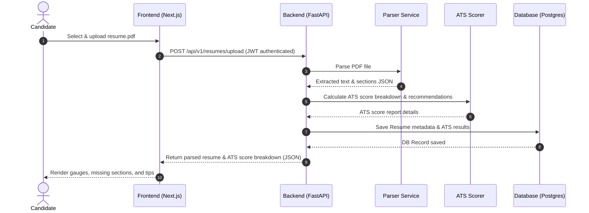
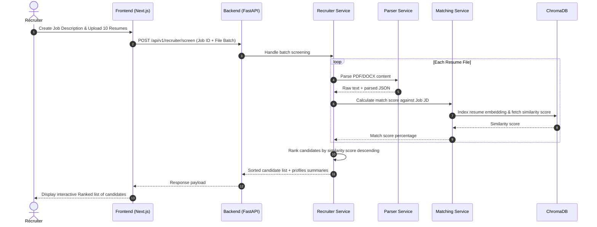

# System Design Document - ResumeFriendly AI

This document provides a detailed overview of the system architecture, component structures, data flow, and processing sequences for the ResumeFriendly AI platform.

---

## 1. High-Level Architecture

ResumeFriendly AI is designed around a decoupled client-server architecture. The frontend application coordinates user interactions, state management, and visual reports, while the backend API processes heavy text parsing, calculations, and vector embedding matching.



### Key Components:
1. **Next.js Web Client**: A client-side optimized interface styled with Tailwind CSS, utilizing Framer Motion for animations and Shadcn UI components.
2. **FastAPI Application**: High-performance asynchronous Python API which exposes JWT authentication, file uploads, parses content, and handles similarity match requests.
3. **PostgreSQL**: Serves as the relational storage engine for structured user profiles, logs, ATS score reports, JDs, and candidate histories.
4. **Sentence Transformers**: Runs standard local embeddings modeling for resumes and JDs without requiring cloud API calls.
5. **ChromaDB**: Simple embedded vector database storing semantic document embeddings for real-time ranking and semantic search queries.
6. **Storage Layer**: Local filesystem directory for saving resumes and documents, hidden behind a file abstraction interface for easy migration to AWS S3.

---

## 2. Component Diagram

The backend system is structured following Clean Architecture principles:

```mermaid
graph TB
    subgraph API Controller Layer
        A1[Auth Router]
        A2[Resume Router]
        A3[ATS Router]
        A4[JD Router]
        A5[Recruiter Router]
    end

    subgraph Service Layer (Business Logic)
        S1[Auth Service]
        S2[Parser Service]
        S3[ATS Scorer]
        S4[Matching Service]
        S5[Recruiter Service]
    end

    subgraph Repository Layer (Data Access)
        R1[User Repository]
        R2[Resume Repository]
        R3[JD Repository]
        R4[ATS Result Repository]
        R5[JD Match Repository]
    end

    subgraph Data & Storage Layer
        D1[(PostgreSQL)]
        D2[(ChromaDB)]
        D3[Local Files]
    end

    A1 --> S1
    A2 --> S2
    A3 --> S3
    A4 --> S4
    A5 --> S5

    S1 --> R1
    S2 --> R2
    S3 --> R4
    S4 --> R3
    S4 --> R5
    S5 --> R3
    S5 --> R2

    R1 & R2 & R3 & R4 & R5 --> D1
    S4 & S5 --> D2
    S2 --> D3
```

---

## 3. Data Flow Diagram (Resume Parsing & Matching)

This diagram shows how a Candidate's Resume is parsed, score-broken-down, and matched against a job description.



---

## 4. Sequence Diagrams

### 4.1 Candidate Resume Upload & ATS Score Generation



### 4.2 Recruiter Multi-Candidate Screening & Ranking


